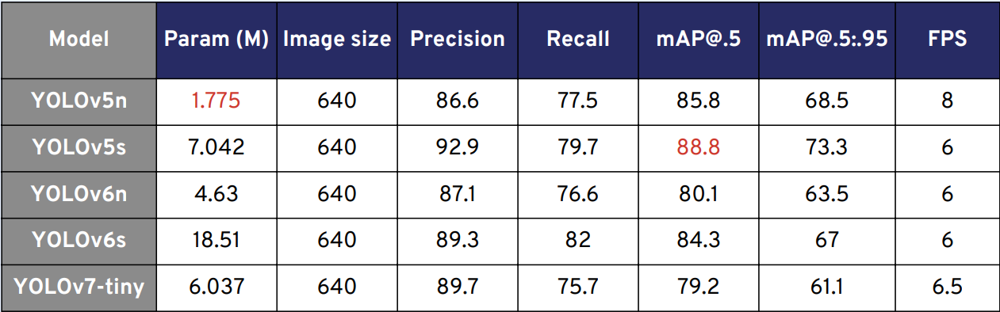

# PBL5: Traffic Signs Dectection System

### 1. Description ###
This project aims to develop a  system for detecting and recognizing traffic signs in real-time using the YOLO algorithms. The project utilizes computer vision techniques and deep learning models to detect and classify various types of traffic signs from images or video streams

[Dataset](https://universe.roboflow.com/pbl-uj4wt/pbl5-6p2ne):
 

### 2. System structure
##### There are 3 main python files as 3 modules:
- [detect_traffic_sign.py] :Run detection inference with GUI
- [train.py] :Train a model on a custom dataset
- [val.py] :Validate a trained detection model on a detection dataset

### 3. Installation
a. Install requirement.txt
```shell
pip install -r requirements.txt
```
b. Run inference
```shell
python detect_traffic_sign.py
```
### 4. Result

